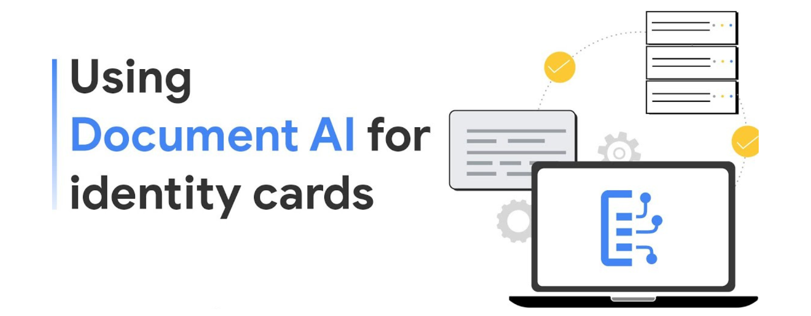

## Search and Recommendation for an Article Website
Our website emerged with recommendation algorithm and search algorithm based on machine learning.
- 
- Tags: Category 1
- Badges:
  - Badge [blue]
- Buttons:
  - Link [https://aicknowledge.z11.web.core.windows.net]

## Search and Recommendation for an Ecommerce Website
Our website emerged with recommendation algorithm and search algorithm based on machine learning.
- 
- Tags: Category 1
- Badges:
  - Badge [blue]
- Buttons:
  - Link [https://ecommercefsoft.z23.web.core.windows.net]

## Document AI
This is a web app with main feature is extract information from image document like: Identity Card, Visa of more than 10 countries.
- 
- Tags: Category 1
- Badges:
  - Badge [blue]
- Buttons:
  - Link []

## Machine learning Platform
This is a web based that allow user upload datasets and choose an algorithm is pre-built. User can adjust paramters of algorithm and tracking multiple experiments.
- 
- Tags: Category 2
- Badges:
  - Badge [blue]
- Buttons:
  - Link []